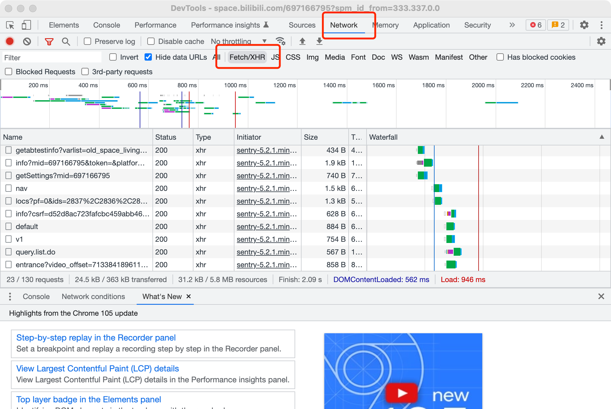
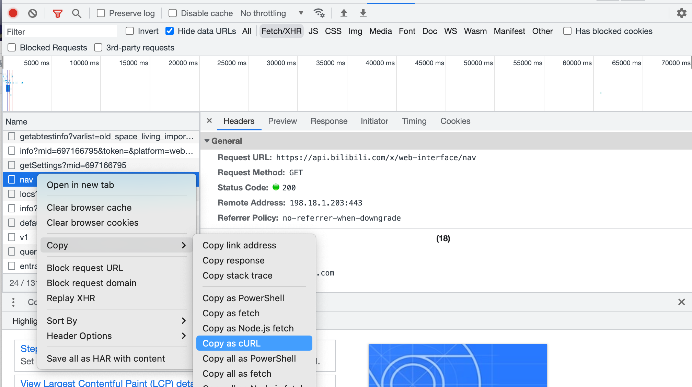
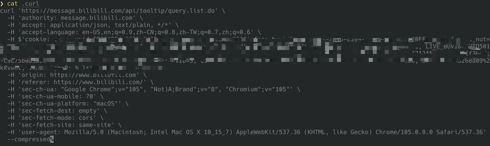
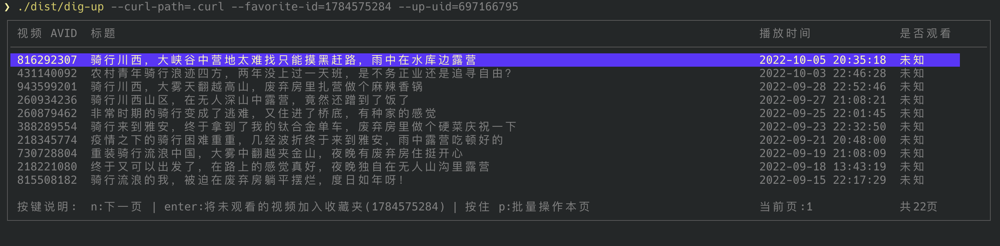

# dig-up

喜欢的 up 好久不更新？快用这个工具来挖一下 up 之前发过的视频吧

> dig-up 可以帮助你批量收藏 up 的投稿中你没看过的视频

## 安装

* 从 github release [页面](https://github.com/Ehco1996/dig-up/releases)可以下载到编译好的版本

* 如果本地有 golang 环境，可以通过 `go install github.com/Ehco1996/dig-up/cmd/dig-up@master` 命令安装

## 视频教程

* https://www.bilibili.com/video/BV1nV4y1L7EX/

## 快速开始

* 打开网页版本的 b 站的 up 主空间，记录 up 主的 uid

  

  这里[徐云](https://space.bilibili.com/697166795)  的 uid 是 697166795

* 右键打开 Inspect 工具

  

* 切换到 Network tap 并只看 Fetch/XHR 页面，刷新 b 站的网页

  

* 随便找一个请求，点击右键 [Copy as cURL]

  

* 将复制的内容存入空白文件中，比如这里我就使用 `.curl` 作为文件名字
  

  这一步是将你 b 站的登录信息保存在本地，这样 dig-up 就有权限来操控你的 b 站收藏夹了

* 找到你想存放 up 主视频的收藏夹 ID

  这里[我创建的收藏夹](https://space.bilibili.com/2960084/favlist?fid=1784575284)  的 id 是 1784575284

  

* 准备工作全部做完了，开始考古吧

  在第 5 步存放`.curl` 文件的目录下执行

  ```bash
  ❯ dig-up --curl-path=.curl --favorite-id=1784575284 --up-uid=697166795
  ```

  

  * 上下箭头按键可以选择投稿
  * 按回车(enter) 可以检查该投稿是否观看过，如果没观看会自动收藏
  * **长按p键** 可以快速处理当前页面的所有投稿
  * 按 n 键，切换到下一页

## 所有参数

```bash
❯ dig-up -h
发现了宝藏 up 主？快来考古吧！

Usage:
  dig-up [flags]

Flags:
      --curl-path string   保存从浏览器里复制的 curl 内容的文件地址 (default ".curl")
      --favorite-id int    收藏夹的 ID
  -h, --help               help for dig-up
      --up-uid int         喜欢的 up 主的 uid，默认 up 是【徐云流浪中国】 (default 697166795)
```

## 自己编译

`make build`
